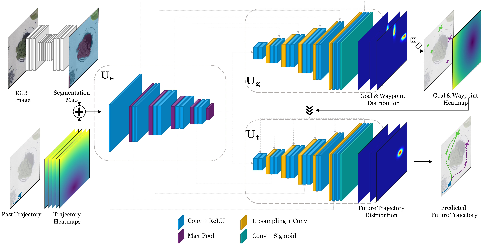

# Re: From Goals, Waypoints & Paths To Long Term Human Trajectory Forecasting

The codebase contains the code for reproducing the following paper: **[From Goals, Waypoints & Paths To Long Term Human Trajectory Forecasting](https://arxiv.org/abs/2012.01526)**

## Abstract
Human trajectory forecasting is an inherently multimodal problem. Uncertainty in future trajectories stems from two sources: (a) sources that are known to the agent but unknown to the model, such as long term goals and (b) sources that are unknown to both the agent & the model, such as intent of other agents & irreducible randomness in decisions. This stochasticity is modelled in two major ways: the epistemic uncertainity which accounts for the multimodal nature of the long term goals and the aletoric uncertainity which accounts for the multimodal nature of the waypoints. Furthermore, the paper extends the existing prediction horizon to upto a minute.  The aforementioned features are encompassed into Y-Net, a scene compliant trajectory forecasting network. The network has been implemented on the following datasets : (a) Stanford Drone (SDD) (b) ETH/UCY (c) Intersection Drone. The network significantly improves upon state-of-the-art performance for both short and long prediction horizon settings. 

</img>
</img>

## Model

</img>

## Setup
The paper was reproduced and tested using Google Colab, with Python 3.8.3 and PyTorch 1.5.1 with CUDA 10.2. The codebase was furthermore integrated with weights and biases for visualization and tabulation of the obtained results. The necessary libraries required for running the code can be found in the [requirements.txt](requirements.txt). 

## Datasets
The Stanford Drone Dataset and the ETH/UCY dataset can be found online and are free to use. The Intersection Drone Dataset was obtained by applying for the same through the following portal : https://www.ind-dataset.com/.

## Contributors

1. Soham Sen
2. Parv Jain
3. Harsh Khandelwal
